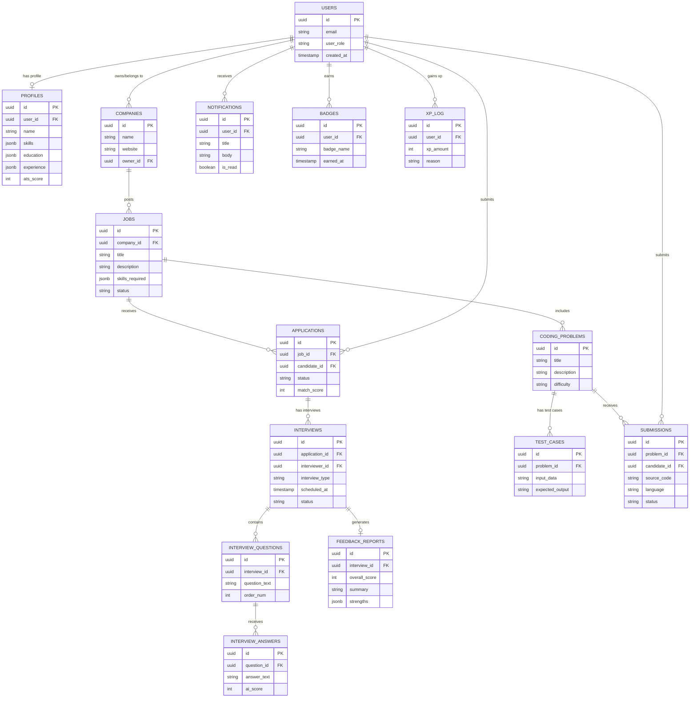

# AI Interview Platform — Entity-Relationship Diagram (14 Locked Tables)

```mermaid
erDiagram
    USERS ||--o| PROFILES : "has profile"
    USERS ||--o{ COMPANIES : "owns/belongs to"
    USERS ||--o{ NOTIFICATIONS : "receives"
    USERS ||--o{ BADGES : "earns"
    USERS ||--o{ XP_LOG : "gains xp"

    COMPANIES ||--o{ JOBS : "posts"
    JOBS ||--o{ APPLICATIONS : "receives"
    USERS ||--o{ APPLICATIONS : "submits"

    APPLICATIONS ||--o{ INTERVIEWS : "has interviews"
    INTERVIEWS ||--o{ INTERVIEW_QUESTIONS : "contains"
    INTERVIEW_QUESTIONS ||--o{ INTERVIEW_ANSWERS : "receives"
    INTERVIEWS ||--o| FEEDBACK_REPORTS : "generates"

    JOBS ||--o{ CODING_PROBLEMS : "includes"
    CODING_PROBLEMS ||--o{ TEST_CASES : "has test cases"
    CODING_PROBLEMS ||--o{ SUBMISSIONS : "receives"
    USERS ||--o{ SUBMISSIONS : "submits"

    USERS {
        uuid id PK
        string email
        string user_role
        timestamp created_at
    }
    PROFILES {
        uuid id PK
        uuid user_id FK
        string name
        jsonb skills
        jsonb education
        jsonb experience
        int ats_score
    }
    COMPANIES {
        uuid id PK
        string name
        string website
        uuid owner_id FK
    }
    JOBS {
        uuid id PK
        uuid company_id FK
        string title
        string description
        jsonb skills_required
        string status
    }
    APPLICATIONS {
        uuid id PK
        uuid job_id FK
        uuid candidate_id FK
        string status
        int match_score
    }
    INTERVIEWS {
        uuid id PK
        uuid application_id FK
        uuid interviewer_id FK
        string interview_type
        timestamp scheduled_at
        string status
    }
    INTERVIEW_QUESTIONS {
        uuid id PK
        uuid interview_id FK
        string question_text
        int order_num
    }
    INTERVIEW_ANSWERS {
        uuid id PK
        uuid question_id FK
        string answer_text
        int ai_score
    }
    CODING_PROBLEMS {
        uuid id PK
        string title
        string description
        string difficulty
    }
    TEST_CASES {
        uuid id PK
        uuid problem_id FK
        string input_data
        string expected_output
    }
    SUBMISSIONS {
        uuid id PK
        uuid problem_id FK
        uuid candidate_id FK
        string source_code
        string language
        string status
    }
    FEEDBACK_REPORTS {
        uuid id PK
        uuid interview_id FK
        int overall_score
        string summary
        jsonb strengths
    }
    NOTIFICATIONS {
        uuid id PK
        uuid user_id FK
        string title
        string body
        boolean is_read
    }
    BADGES {
        uuid id PK
        uuid user_id FK
        string badge_name
        timestamp earned_at
    }
    XP_LOG {
        uuid id PK
        uuid user_id FK
        int xp_amount
        string reason
    }
```
