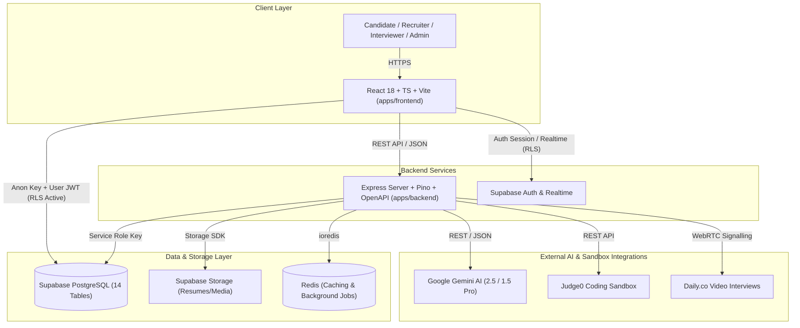

# AI Interview Platform — System Architecture

This document outlines the high-level architecture of the autonomous technical hiring platform.

```mermaid
graph TD
    subgraph Client Layer
        C["Candidate / Recruiter / Interviewer / Admin"] -->|HTTPS| FE["React 18 + TS + Vite (apps/frontend)"]
    end

    subgraph Backend Services
        FE -->|REST API / JSON| BE["Express Server + Pino + OpenAPI (apps/backend)"]
        FE -->|"Auth Session / Realtime (RLS)"| SUP_AUTH["Supabase Auth & Realtime"]
    end

    subgraph Data & Storage Layer
        BE -->|Service Role Key| SUP_DB[("Supabase PostgreSQL (14 Tables)")]
        FE -->|"Anon Key + User JWT (RLS Active)"| SUP_DB
        BE -->|Storage SDK| SUP_STORAGE["Supabase Storage (Resumes/Media)"]
        BE -->|ioredis| REDIS[("Redis (Caching & Background Jobs)")]
    end

    subgraph External AI & Sandbox Integrations
        BE -->|"REST / JSON"| GEMINI["Google Gemini AI (2.5 / 1.5 Pro)"]
        BE -->|"REST API"| JUDGE0["Judge0 Coding Sandbox"]
        BE -->|"WebRTC Signalling"| DAILY["Daily.co Video Interviews"]
    end
```
